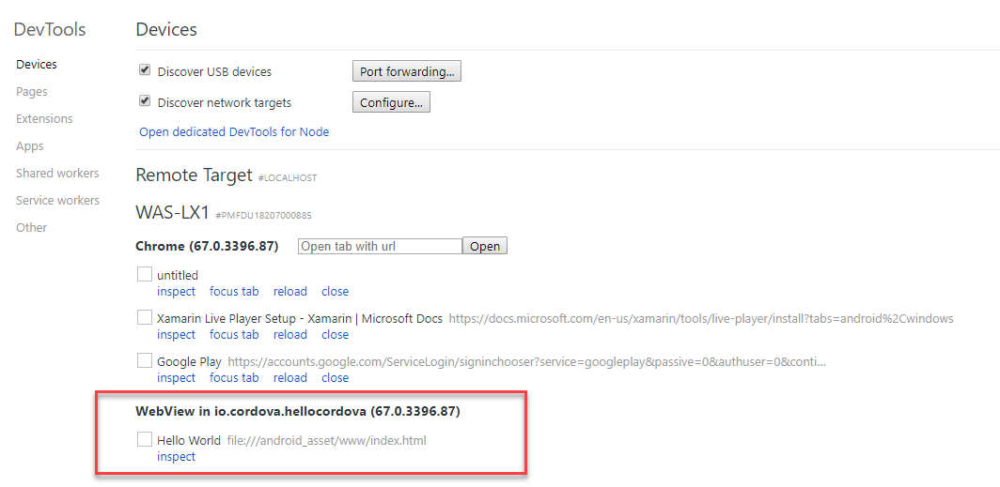

# Native Device Access using Cordova

## Requirements

### Xcode

[Xcode Home](https://developer.apple.com/xcode/)

### Android Studio

[Android Studio Home](https://developer.android.com/studio/)

[Create Virtual Device](https://developer.android.com/studio/run/managing-avds)

#### Setup Android Emulator

4 Steps to success:

SDK installed to User_Profile\AppData\Local\Android\Sdk by default

- Download & Install Android Studio
- Install SDK, HAXM, Build Tools, System image
- Set Path variables
- [Create Virtual Device](https://developer.android.com/studio/run/managing-avds)

#### Setup Android Device

- Setup Android Device Bridge (adb)
- Configure Chrome for Remote Debugging

[Android Device Bridge - Gettings started](https://www.xda-developers.com/install-adb-windows-macos-linux/)

Open Chrome - Go to:

```
chrome://inspect/#devices
```



## Usefull Tools

[Fake Geo Location - Chrome Add-In](https://chrome.google.com/webstore/detail/manual-geolocation/jpiefjlgcjmciajdcinaejedejjfjgki?hl=en)

[Genymotion Android Emulator](https://www.genymotion.com/) - Requires Virtual Box
